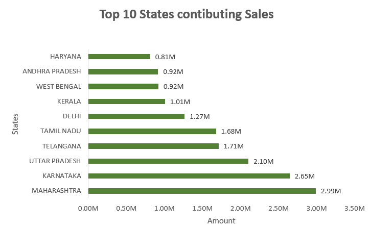
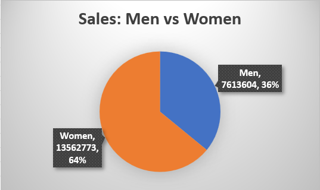
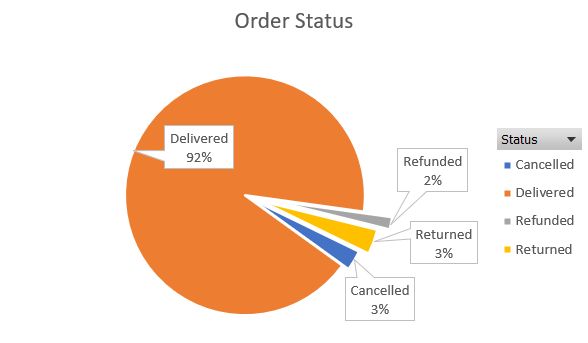
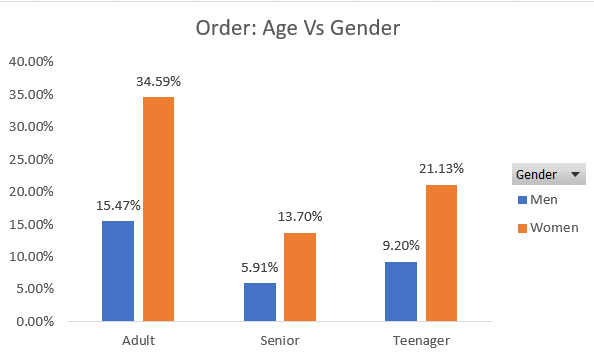
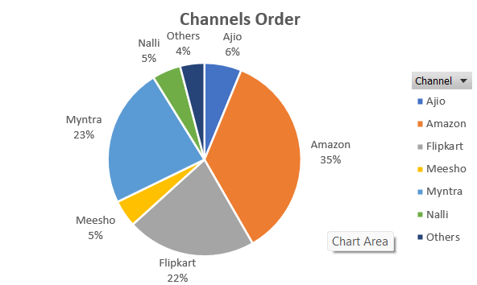
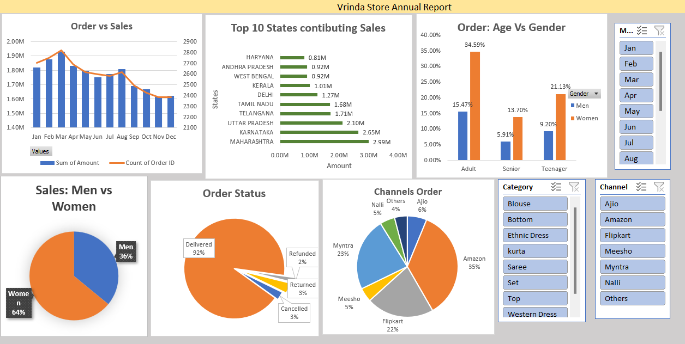
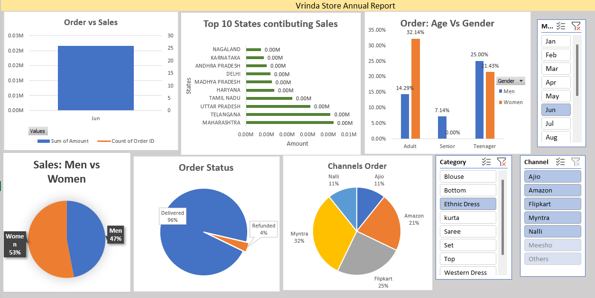

# Project Overview
Compared monthly sales and orders to identify peak months.
Analyzed purchase patterns by gender and age.
Visualized order status and sales contributions from top 10 states.
 Examined sales channels and highest selling product categories.

 #Visualizations
 
  
 
 
  
   
    
     
 
 
